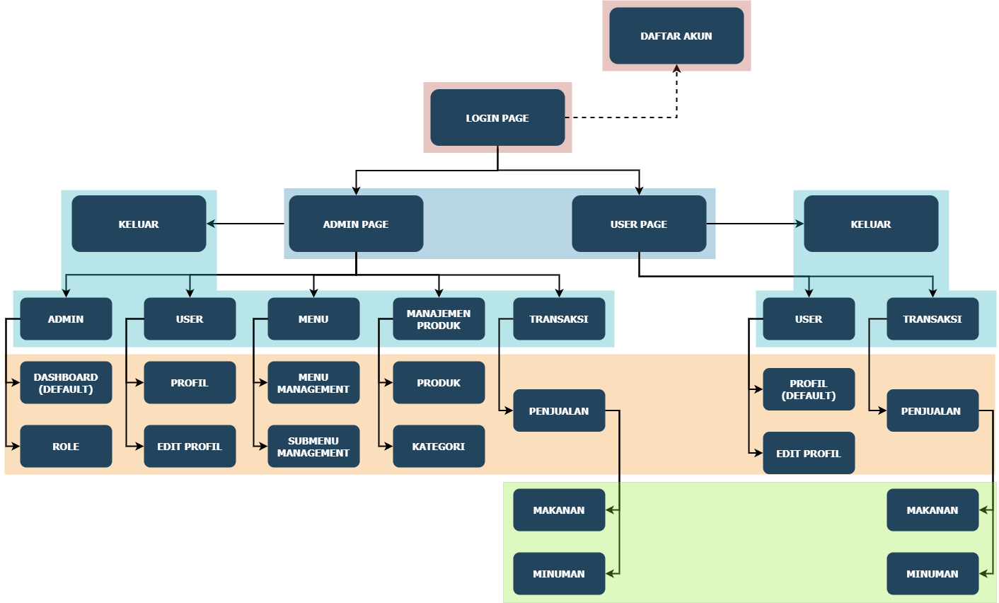

# **APLIKASI PENJUALAN (POINT OF SALE) BERBASIS WEBSITE**

### Disusun Oleh Kelompok 6 :
1. Eka Rizqy Mar'atus Sholohah (19081010022)
2. Alfine Damayanti (19081010039)
3. Muhammad Lutfi Pratama (19081010049)
4. Fransiskuks Jonathan Tanudjaja (19081010062)
5. Almira Aurora Prameswaty (19081010137)

# **Tampilan Aplikasi**
---
- ## Logo Aplikasi
  

- ## Halaman Utama - Admin
<!-- Dashboard -->

- ## Halaman Utama - User (Kasir)
<!-- Penjualan -->

# **Deskripsi Aplikasi**
---
- Aplikasi POS (Point of Sale) merupakan sistem berbasis website yang dapat mempermudah manajemen penjualan produk di sektor restoran atau F&B. Kami merancang modul penjualan pada sisi kasir (user) dan admin. 

- Saat pelanggan restoran melakukan pembelian produk, kasir dapat dengan mudah mengirim data hasil penjualan di hari itu. Admin akan memantau hasil penjualan dan melakukan invoice. 

- Aplikasi juga menyediakan manajemen user, jadi baik kasir ataupun admin dapat mengedit profilnya. Admin memiliki akses dalam manajemen fitur seperti, olah menu, submenu, akses user (role), oleh produk penjualan dan kategori, dan riwayat penjualan. 
   
# **Sitemap/Hierarki Aplikasi**
---


## Penjelasan Sitemap - Menu

- ## Akun
  - ### Registration Page
    Halaman ini digunakan jika pengguna belum memiliki akun maka, pengguna diminta untuk membuat user baru dengan memberikan inputan berupa nama lengkap, email serta password. 
    
  - ### Login Page
    Halaman ini menerima masukkan email dan password user yang telah terdaftar dan akan diarahkan ke halaman utama aplikasi sesuai dengan role user. Pada halaman ini juga terdapat fitur lupa password.  

- ## Admin Page
  - ### Menu - Admin
    Menu Admin berisi submenu Dashboard dan Kelola Role. Dashboard berisi rincian hasil transaksi penjualan oleh user (Kasir) dalam bentuk table list. Admin dapat melihat detail tiap penjualan produk pada setiap invoice. Pada bagian submenu Role digunakan untuk mengelola hak akses menu tiap user/kasir. Selain mengelola hak akses disini kita juga bisa menambahkan, mengedit dan menghapus role yang kita inginkan.
    
  - ### Menu - User
    Menu user memberikan akses ke tampilan profil dan edit profil. Submenu Profil menampilkan rincian profil user yang terdaftar pada sistem. Di menu ini user dapat juga mengedit profilnya seperti foto profil, nama, dan sebagainya pada submenu Edit Profil.

  - ### Menu - Manajemen Menu
    Menu ini memberikan akses admin untuk melakukan kelola Menu dan Submenu pada sistem. Admin dapat membuat, menghapus dan mengedit menu dan submenu. Konsep CRUD diterapkan pada menu ini. Untuk kelola menu ada pada submenu Menu Management dan kelola submenu pada Submenu Management.

  - ### Menu - Manajemen Produk
    Menu ini berfungsi untuk menambahkan data produk baru yang akan dijual. Admin dapat menambah, menghapus dan mengedit produk baru pada submenu Produk. Admin juga dapat megelola kategori pada produk-produk yang dijual.

  - ### Menu - Transaksi
    Karena admin memiliki akses penuh terhadap lingkungan sistem, maka admin juga memiliki akses untuk melakukan transaksi penjualan.

- ## User/Kasir Page
  - ### Menu - User
    Kasir dapat melihat tampilan profil dan melakukan edit profil. Submenu Profil menampilkan rincian profil user yang terdaftar pada sistem. Pada submenu Edit Profil, user dapat mengedit profilnya seperti foto profil, nama, dan sebagainya. 

  - ### Menu - Transaksi
    Saat pembeli melakukan transaksi, kasir akan mengirim data transaksi pembelian produk melalui menu ini. Submenu Penjualan akan menampilkan daftar produk yang siap jual berdasarkan jenis dan kategorinya. Terdapat opsi metode pembayaran yang tersedia. Jika transaksi sukses sistem akan memberikan notifikasi secara langsung.
    
# **TEKNOLOGI YANG DIGUNAKAN DALAM PENGEMBANGAN APLIKASI**
---
- ### Code Ignitor 3  
  CodeIgniter merupakan framework yang bersifat open-source yang berupa kerangka kerja PHP dengan model MVC (Model, View, Controller) untuk membangun situs web dinamis dengan menggunakan PHP. CodeIgniter memudahkan pengembang web untuk membuat aplikasi web dengan cepat dan mudah dibandingkan dengan membuatnya dari awal.

- ### Bootstrap 4  
  Bootstrap adalah framework CSS untuk membuat tampilan web yang responsive menggunakan HTML, CSS dan JS. Bootstrap menyediakan class dan komponen yang siap dipakai, sehingga kita tidak perlu menulis kode CSS dari nol. 

- ### MySQL
  MySQL adalah sebuah DBMS (Database Management System) menggunakan perintah SQL (Structured Query Language) yang banyak digunakan saat ini dalam pembuatan aplikasi berbasis website. MySQL termasuk ke dalam RDBMS (Relational Database Management System). Sehingga, menggunakan tabel, kolom, baris, di dalam struktur database-nya. Jadi, dalam proses pengambilan data menggunakan metode relational database. Dan juga menjadi penghubung antara perangkat lunak dan database server. PhpMyAdmin adalah perangkat lunak dengan bahasa PHP yang digunakan untuk menangani administrasi MySQLnya.

- ### JQuery  
  jQuery adalah library JavaScript yang cukup andal, ringkas, dan mempunyai fitur yang cukup lengkap. Library ini membuat pemrosesan di HTML seperti perubahan dan manipulasi dokumen, event handling, animasi, dan Ajax dapat menjadi lebih sederhana. Hal ini didukung dengan API yang mudah digunakan dan dapat bekerja di berbagai macam browser. Fungsi jQuery secara umum adalah sebagai library JavaScript yang akan membantu mengatur interaksi antara JavaScript dengan HTML yang berjalan di sisi klien. 

- ### CSS  
  CSS adalah kepanjangaan dari Cascading Style Sheets yang berguna untuk menyederhanakan proses pembuatan website dengan mengatur elemen yang tertulis di bahasa markup. CSS dipakai untuk mendesain tampilan website (front end).

# **CARA PENGGUNAAN APLIKASI**
---
- ## ADMIN
  Terdapat akun khusus admin untuk mengakses halaman admin pada aplikasi. Halaman awal pada aplikasi adalah menu **Dashboard**. Di menu ini Admin dapat mengecek data-data hasil transaksi penjualan dari sisi kasir (user) berdasarkan id invoice. Setiap baris data terdapat button detail untuk melihat detail produk yang terjual, admin dapat melakukan invoice data penjualan. Table data penjualan terdapat juga nama-nama kasir yang bertanggung jawab dalam transaksi di hari tersebut. 

  Admin memiliki akses untuk mengontrol hak akses semua menu dan submenu pada aplikasi, contohnya halaman kasir tidak bisa mengakses menu kontrol role. Dalam **Manajemen Role**, admin dapat membuat role baru, artinya misal dalam suatu restoran terdapat lebih dari satu kasir. Selain itu admin juga dapat mengedit dan menghapus role. Admin dapat melihat rincian profilnya pada menu Profil. Jika ada data yang tidak sesuai atau hanya ingin mengganti foto profil, admin dapat mengubahnya pada submenu edit profil.
  
  Jika admin menambah menu dan submenu baru, artinya menyediakan tempat di aplikasi untuk pengembangan fitur baru. Admin memiliki hak akses untuk submenu **Menu Management** dan **Submenu Management**. Disini admin juga dapat mengedit dan menghapus Menu dan Submenu yang telah tersedia di aplikasi. Sistem menyediakan juga opsi aktivasi submenu, bila admin tiba-tiba ingin menonaktifkan beberapa fitur yang terdapat pada submenu. Admin dapat dengan mudah memantau semua menu dan submenu yang tersedia pada list table. 

  Admin memiliki akses untuk mengontrol produk yang akan dijual. Jika restoran memiliki produk baru, admin dapat menambahkan dan menentukan harga produk tersebut pada submenu **Produk**. Jika masuk ke kategori makanan baru, admin juga dapat menambahkan kategori baru pada submenu **Kategori**. Data produk dan kategori yang telah disimpan masih dapat diubah oleh admin, misal update gambar makanan/minuman, nama produk, dsb. Admin dapat menghapus juga data produk dan kategori yang telah ada. Jika dirasa semua akses dan olah data telah selesai, admin dapat melakukan **Logout** untuk keluar dari aplikasi. 
  

- ## KASIR
  Untuk menjalankan aplikasi Point of Sale sebagai kasir(user), pertama-tama pengguna harus mendaftarkan akun baru terlebih dahulu jika pengguna belum memiliki akun. Dengan memasukkan email, nama lengkap serta password, selanjutnya setelah itu pengguna akan diarahkan untuk login aplikasi disini pengguna dapat memasukkan email serta password yang sesuai dengan yang telah dimasukkan pada saat pembuatan akun. Setelah berhasil login, sebagai kasir pengguna akan diarahkan ke halaman default yaitu halaman **My Profile**, disini pengguna dapat melihat informasi mengenai dirinya seperti nama lengkap, gambar dan lainnya. Selanjutnya pengguna dapat melakukan perubahan pada profil pada halaman **Edit Profile** jika ingin merubah data diri pengguna.
  
  Setelah itu, sebagai kasir tersedia menu ***Transaksi*** yang didalamnya ada fitur **Penjualan** dimana disini sebagai kasir, pengguna dapat merekam penjualan barang yang dibeli oleh customer. Langkah-langkahnya adalah pertama kasir memilih jenis penjualan, entah itu makanan/minuman selanjutnya kasir dapat memilih kategori dari jenis barang tersebut dan kasir memasukkan jumlah produk yang sesuai dengan yang dibeli oleh customer ke dalam keranjang. Setelah semua barang masuk ke dalam keranjang maka kasir dapat melakukan checkout keranjang dan akan diarahkan ke halaman metode pembayaran, disini kasir memasukkan metode pembayaran sesuai dengan yang diinginkan customer dan pembayaran dilakukan dan berhasil. Kasir dapat melakukan **Logout** untuk keluar dari aplikasi POS, jika jam kerja telah selesai.

# **FITUR - FITUR YANG DITAWARKAN**
___  

## FITUR LOGIN & REGISTRATION
  1. ### Fitur Registration 
      Halaman ini digunakan jika pengguna belum memiliki akun bertujuan untuk membuat user baru.
      <!-- Tampilan Registrasi Page -->
    
  2. ### Fitur Login
      Halaman ini akan mengarahkan user ke halaman utama aplikasi sesuai dengan role user. Disini juga terdapat fitur lupa password. 
      <!-- Tampilan Login Page -->

## FITUR WEB AS CASHIER
Fitur-fitur yang disediakan oleh aplikasi POS ini untuk role user / kasir, antara lain :

1. ### Fitur Olah Profil  
   - Fitur ini akan menampilkan informasi pribadi mengenai user seperti nama, email dan lainnya.
    <!-- Tampilan My Profile -->
   - Fitur ini akan menampilkan halaman untuk memperbaharui informasi pribadi seperti nama dan gambar.
    <!-- Tampilan Edit Profile -->  

2. ### Fitur Penjualan
    Pada fitur ini akan ditampilkan jenis produk, kategori produk, produk, cart belanja, metode pembayaran serta halaman succes pembayaran.
     - Jenis produk seperti makanan dan minuman.
        <!-- Jenis Produk -->
     - Kategori produk seperti nasi, mie dan sebagainya.
        <!-- Kategori produk    -->
     - Produk seperti cocacola, nasi goreng dan lain-lain.   
        <!-- Produk -->
     - Cart belanja akan berisikan produk-produk yang dipilih beserta harga setiap produk.   
        <!-- Cart Belanja -->
     - Metode pembayaran akan menampilkan pilihan metode pembayaran serta harga total.
        <!-- Metode Pembayaran -->
     - Halaman success pembayaran.
        <!-- Halaman Success -->

## FITUR WEB AS ADMIN
Fitur-fitur yang disediakan oleh aplikasi POS ini untuk role admin, antara lain :

1. ### Fitur Riwayat Penjualan (Invoice)
   - Fitur ini akan menampilkan riwayat penjualan produk makanan / minuman dalam bentuk tabel. Terdapat 5 kolom  meliputi : ID invoice, Penanggungjawab, Metode Pembayaran, Tanggal Pembayaran serta aksi untuk menampilkan detail invoice.
   <!-- Tampilan Riwayat Penjualan -->
   - Menampilkan detail invoice yang berisikan informasi mengenai produk yang terjual serta harga jual produk.
    <!-- Tampilan Detail Invoice -->  

2. ### Fitur Kelola Hak Akses
   - Fitur ini dapat mengatur hak akses setiap role terhadap menu yang tersedia. Menerapkan CRUD Role. 
    <!-- List role -->
    <!-- Tampilan Create Role -->
    <!-- Tampilan Edit Role -->
   - Menampilkan halaman untuk mengedit hak access pada role yang dipilih.
    <!-- Tampilan Access Role -->  
    
3. ### Fitur Olah Profil
   - Fitur ini akan menampilkan informasi pribadi mengenai admin seperti nama, email dan lainnya.  
    *Gambar sama seperti pada fitur olah profil user / kasir.*
   - Fitur ini membuat admin dapat memperbaharui informasi pribadi mereka seperti nama dan gambar.  
    *Gambar sama seperti pada fitur olah profil user / kasir.*

4. ### Fitur Management Menu 
   - Fitur ini dapat mengelola setiap menu pada aplikasi. Menerapkan CRUD Menu.
    <!-- List Menu -->
    <!-- Tampilan Create Menu -->
    <!-- Tampilan Edit Menu -->

5. ### Fitur Management SubMenu 
   - Fitur ini dapat mengelola setiap submenu berdasarkan menu yang tersedia pada aplikasi. Menerapkan CRUD Submenu.
    <!-- List SubMenu -->
    <!-- Tampilan Create SubMenu -->
    <!-- Tampilan Edit SubMenu -->

6. ### Fitur Manajemen Produk
   - #### Produk
      Fitur ini dapat mengelola produk penjualan berdasarkan kategori. Menerapkan CRUD Produk dan Pagination.
    <!-- List Produk + Pagination -->
    <!-- Tampilan Create Produk -->
    <!-- Tampilan Edit Produk -->
  
    - #### Kategori
      Fitur ini dapat mengelola setiap kategori produk yang tersedia pada aplikasi. Menerapkan CRUD Kategori.
      <!-- List Kategori -->
      <!-- Tampilan Create Kategori -->
      <!-- Tampilan Edit Kategori -->

# **KODE - KODE INTI**
_____
## **Config**
  - ### Autoload
    ```php
    $autoload['libraries'] = array('database', 'email', 'session', 'form_validation', 'pagination', 'cart');

    $autoload['helper'] = array('url', 'file', 'security', 'pos'); 
    ```
    Kita memanfaatkan beberapa library CI3 seperti tertera pada kode diatas dan beberapa helper CI3 untuk fungsionalitas app.   
    
  - ### Config
    ```php
    $config['base_url'] = 'http://localhost/ci-app/';
    
    $config['index_page'] = '';
    ```
    Memudahkan akses langsung ke kontroler utama. 

  - ### Database
    ```php
    $db['default'] = array(
    'dsn'	=> '',
    'hostname' => 'localhost',
    'username' => 'root',
    'password' => '',
    'database' => 'ci-app_login',
    'dbdriver' => 'mysqli',
    'dbprefix' => '',
    'pconnect' => FALSE,
    'db_debug' => (ENVIRONMENT !== 'production'),
    'cache_on' => FALSE,
    'cachedir' => '',
    'char_set' => 'utf8',
    'dbcollat' => 'utf8_general_ci',
    'swap_pre' => '',
    'encrypt' => FALSE,
    'compress' => FALSE,
    'stricton' => FALSE,
    'failover' => array(),
    'save_queries' => TRUE
    );
    ```
    Konfigurasi database sesuai dengan yang kita buat pada phpMyAdmin.
    
  - ### Router
    ```php
    $route['default_controller'] = 'Auth'; 
    $route['404_override'] = '';
    $route['translate_uri_dashes'] = FALSE;
    $route['produk/(:num)'] = 'produk';
    ``` 
    Konfigurasi default route 'Auth' dan konfigurasi pagination pada produk.

## **Global**
  ```php
  $this->load->library('form_validation'); 
  ```   
  ```php
  $this->load->model('invoice_model');
  $this->load->model('menu_model');
  ``` 
  ```php
  $this->load->helper('url');
  is_logged_in();
  ``` 
  Inisialisasi library, helper dan model yang digunakan kontroler.

## **Controller**
  - ### Auth
    #### 1. Index()
    ```php
    if($this->form_validation->run() == false){
      $data['title'] = 'Login Page';
      $this->load->view('templates/auth_header', $data);
      $this->load->view('auth/login');
      $this->load->view('templates/auth_footer');
    } else {
        // validasinya success
        $this->_login();
    }
    ```
    Melakukkan validasi data login, jika gagal akan menampilkan kembali halaman login. 
    
    #### 2. _Login()
    ```php
    if($user){
        //jika usernya aktif
        if($user['is_active'] == 1){
            // cek password
            if(password_verify($password, $user['password'])) {
                $data = [
                    'email' => $user['email'],
                    'role_id' => $user['role_id']
                ];
                $this->session->set_userdata($data);

                if($user['role_id'] == 1) {
                    unset($_SESSION['message']);   // to destroy specific session
                    redirect('admin');
                } else {
                    unset($_SESSION['message']);    // to destroy specific session
                    redirect('user');
                }
            } else {
                $this->session->set_flashdata('message', '<div class="alert alert-danger" role="alert">Wrong password!</div>');
                redirect('auth');
            }
        } else {
            $this->session->set_flashdata('message', '<div class="alert alert-danger" role="alert">This email has not been activated!</div>');
            redirect('auth');
        }
    } else {
        $this->session->set_flashdata('message', '<div class="alert alert-danger" role="alert">Email is not registered!</div>');
        redirect('auth');
    }
    ```
    Function yang berfungsi untuk memvalidasi inputan dari informasi login yang diisikan user. Function ini menentukan apakah user dapat berhasil login dan role user saat login.
    
    #### 3. Registration()
    ```php
    if($this->form_validation->run() == false){
      $data['title'] = 'POS User Rregistration';
      $this->load->view('templates/auth_header', $data);
      $this->load->view('auth/registration');
      $this->load->view('templates/auth_footer');
    } else {
      $data = [
          'name' => htmlspecialchars($this->input->post('name', true)),
          'email' => htmlspecialchars($this->input->post('email', true)),
          'image' => 'default.jpg',
          'password' => password_hash($this->input->post('password1'), PASSWORD_DEFAULT),
          'role_id' => 2,
          'is_active' => 1,
          'date_created' => time()
      ];

      $this->db->insert('user', $data);
      $this->session->set_flashdata('message', '<div class="alert alert-success" role="alert">Congratulation! Your account has been created. Please Login</div>');
      redirect('auth');
    }
    ```
    Bertujuan untuk memasukkan inputan user mengenai informasi data diri ke dalam database, jika inputan sudah sesuai dengan ketentuan sistem.

    #### 4. _SendEmail()
    ```php
    if ($this->email->send()) {
      return true;
    } else {
      echo $this->email->print_debugger();
      die;
    }
    ```
    
    Code untuk mengirim email saat akses forget password.

    #### 5. ForgotPassword()
    ```php
    $token = base64_encode(random_bytes(32));
    $user_token = [
      'email' => $email,
      'token' => $token,
      'date_created' => time()
    ];

    $this->db->insert('user_token', $user_token);
    $this->_sendEmail($token, 'forgot');
    ```
  
    Membuat data token untuk mengaktifkan kirim email pada fitur forget password. 

    #### 6. ResetPassword()
    ```php
    $user_token = $this->db->get_where('user_token', ['token' => $token])->row_array();

    if ($user_token) {
      $this->session->set_userdata('reset_email', $email);
      $this->changePassword();
    }
    ```
    Memanggil fungsi chagePassword() jika token ada.

    #### 7. ChangePassword()
    ```php
    $password = password_hash($this->input->post('password1'), PASSWORD_DEFAULT);
    $email = $this->session->userdata('reset_email');

    $this->db->set('password', $password);
    $this->db->where('email', $email);
    $this->db->update('user');

    $this->session->unset_userdata('reset_email');

    $this->db->delete('user_token', ['email' => $email]);
    ```
    
    Kode ini berfungsi untuk mengganti dengan password yang baru.

    #### 8. logout()
    ```php
    $this->session->unset_userdata('email');
    $this->session->unset_userdata('role_id');
    ```
    
    Destroy session untuk data user.
    
  - ### Admin
   ```php 
  $data['user'] = $this->db->get_where('user', ['email' => $this->session->userdata('email')])->row_array();
  $data['role'] = $this->db->get('user_role')->result_array();
  ```
  Ambil data untuk validasi berdasarkan user rolenya

  ```php 
  $data['user'] = $this->db->get_where('user', ['email' => $this->session->userdata('email')])->row_array();
  $data['role'] = $this->db->get('user_role')->result_array();
  ```

  
  - ### User 

  - ### Menu
  - ### Produk
  - ### Penjualan
  - ### Invoice

## **Models** 
  - ### Menu Model
  - ### Invoice Model

## **View**
  - ### Auth
  - ### Templates
  - ### Admin
  - ### User 
  - ### Menu
  - ### Produk
  - ### Penjualan